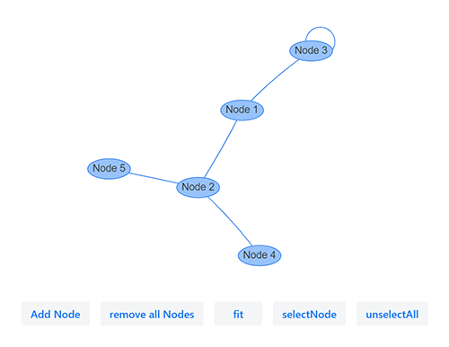

# Vis.js Network diagram for Vaadin Framework

Vaadin 14 Java integration of [vis-network](https://github.com/visjs/vis-network)

---
[Vis.js](http://visjs.org) is a dynamic, browser based visualization library. The library uses JSON for configuration and communication.

[vis-network](https://github.com/visjs/vis-network) is a visualization to display networks and networks consisting of nodes and edges.

- Forked from [watho/vaadin-flow-visjs](https://github.com/watho/vaadin-flow-visjs)
- Implements the **new version vis.js network module (9.0.4)** for **Vaadin 14(LTS)**.
- Supports **NPM** mode on Vaadin 14+
  
### vis-network documentation:
[https://visjs.github.io/vis-network/docs/network/](https://visjs.github.io/vis-network/docs/network/)
### vis-network examples:
[https://visjs.github.io/vis-network/examples/](https://visjs.github.io/vis-network/examples/) 
(Not everything is possible with this addon)

### Starting the test/demo server:
- Run `mvn jetty:run`.
- Open http://localhost:8080 in the browser.

